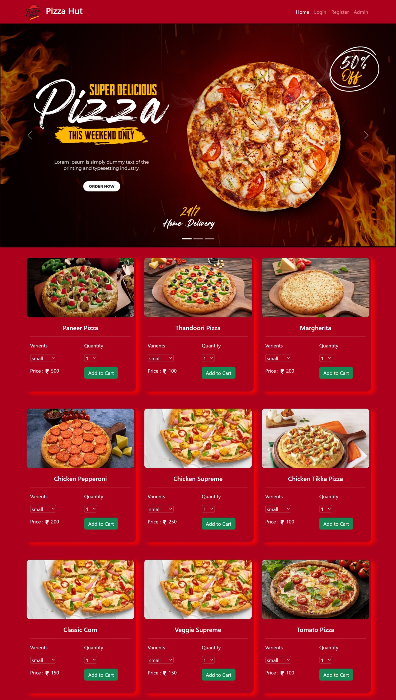
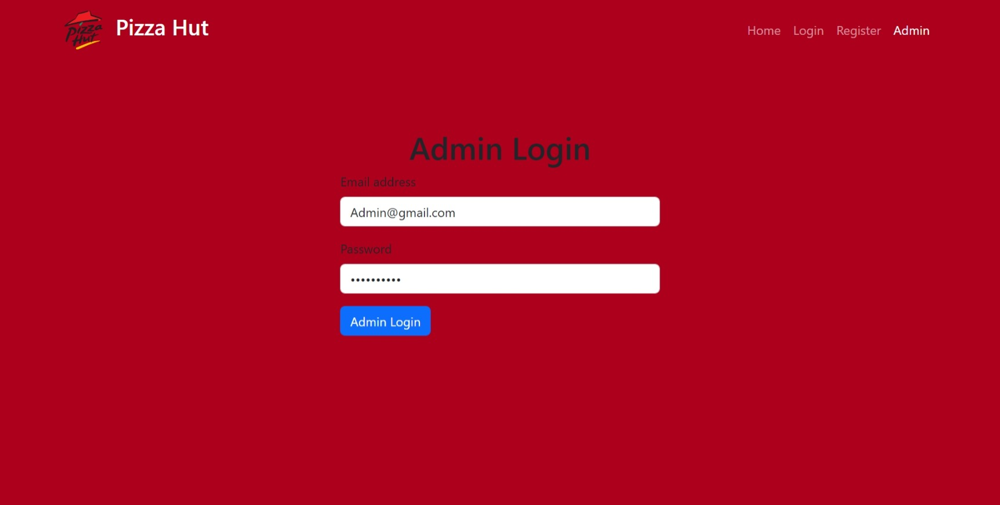
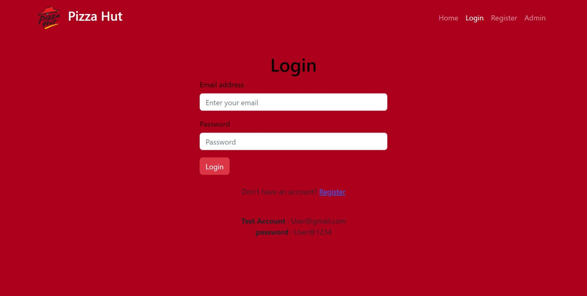

<h2>Hai Everyone..!<h2/>

I am creating Pizza delivery app

If you check the live page...?

<a href="https://pizza-hunt-my.netlify.app">Click here<a/>
 

Backend link

<a href="https://github.com/Ramraghul/Pizza_App_Backend">https://github.com/Ramraghul/Pizza_App_Backend<a/>
<h5>Check out Use this credential fake Acc<h5/>
<h3>Account Number : 5158684307675884   MasterCard<h3/>
<h3> Exp date : 4/2025<h3/>
<h3> CC : 123<h3/>
 
<h3>Adding image's also<h3/>
 
<h4>Home<h4/>

 
<h4>Admin Login<h4/>

 
<h4>User Login<h4/>

